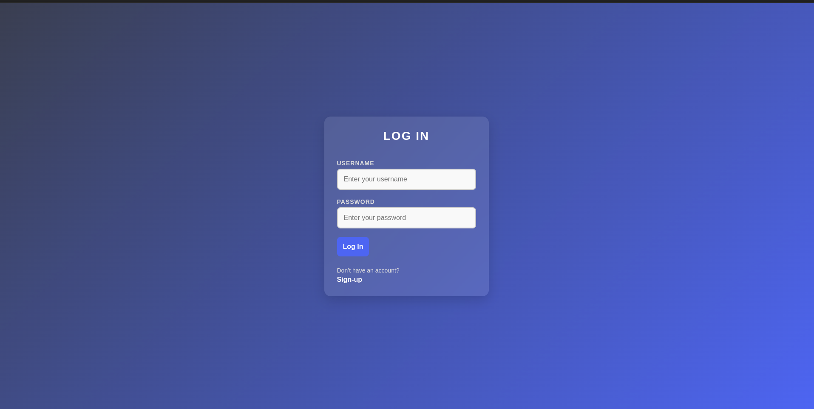
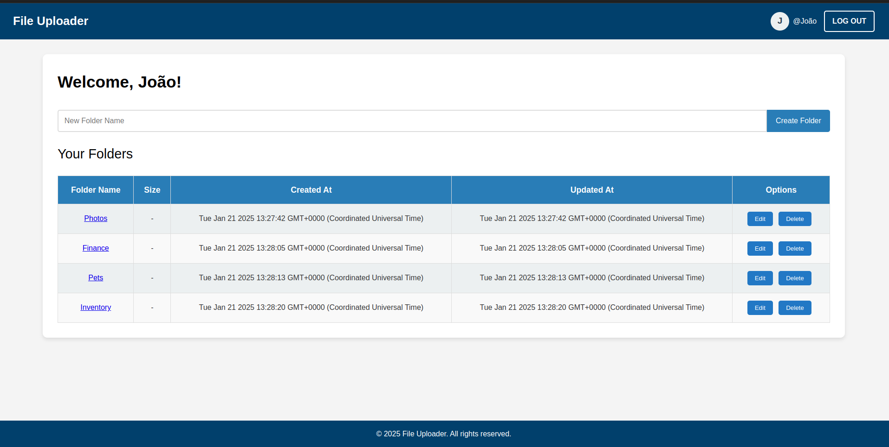
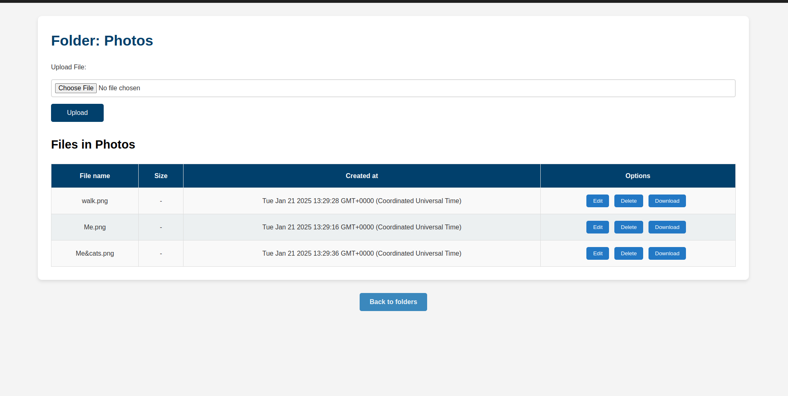

# File Management System with Folders and Cloud Storage

This project is a full-stack application built using **Express**, **Prisma**, and **Passport.js**, featuring session-based authentication, folder and file management, and cloud storage integration.

## Screenshots

| Log In                                         | Home                                       | Files                                        |
| ---------------------------------------------- | ------------------------------------------ | -------------------------------------------- |
|  |  |  |

## Live

Check out the live application below:

[File Uploader](https://file-uploader-production-1ba7.up.railway.app/)

## Features

1. **Session-Based Authentication**:

   - Implemented using Passport.js with a Prisma session store to persist sessions in the database.

2. **File Uploads**:

   - Authenticated users can upload files into folders.
   - File uploads are managed using the `multer` middleware.

3. **Folder Management**:

   - Users can create, read, update, and delete folders.
   - Files can be organized within specific folders.

4. **File Details**:

   - View detailed information about each file, including:
     - File name
     - Size
     - Upload timestamp
   - A download button to download files.

5. **Cloud Storage**:
   - Files are uploaded to a cloud storage service (Cloudinary).
   - File URLs are saved in the database for retrieval and download.

## Technologies Used

- **Backend**:

  - [Node.js](https://nodejs.org/) with [Express](https://expressjs.com/)
  - [Prisma ORM](https://www.prisma.io/) for database management
  - [Passport.js](http://www.passportjs.org/) for authentication
  - [multer](https://github.com/expressjs/multer) for file uploads
  - Cloudinary

- **Frontend**:

  - EJS templates for server-side rendering

- **Database**:
  - PostgreSQL with Prisma as the ORM

## Installation

1. Clone the repository:

   ```bash
   git clone https://github.com/joaocorreiaprof/File-Uploader
   cd File-Uploader

   ```

2. Install dependecies:

   ```bash
   npm install

   ```

3. Set up database:

   - Create a PostgreSQL database.
   - Configure the .env file with your database connection string:

   ```makefile
   DATABASE_URL=your-database-url
   SESSION_SECRET=your-session-secret
   CLOUDINARY_URL=your-cloudinary-url

   ```

4. Run Prisma migrations:

   ```bash
   npx prisma migrate dev

   ```

5. Start the application
   ```bash
   npm start
   ```

## Usage

1. Authentication:
   - Register and log in to access the application.
2. Folder Management:
   - Create, edit, delete, and view folders.
3. File Uploads:
   - Navigate to a folder and upload files using the upload form.
4. File Details and Downloads:
   - View file details and download files directly from the app.

## Project Structure

```plaintest
File-Uploader/

├── app.js              # Main application entry point
├── cloudinary.js       # Cloudinary configuration for file uploads
├── multer.js           # Multer middleware configuration for file handling
├── passport-config.js  # Passport.js configuration for authentication
├── controllers/        # Controllers for handling route logic
├── node_modules/       # Node.js dependencies (auto-generated)
├── package.json        # Project metadata and dependencies
├── package-lock.json   # Dependency tree lock file
├── prisma/             # Prisma schema and migrations
│ ├── migrations/       # Database migrations
│ └── schema.prisma     # Prisma schema file
├── public/             # Static assets (CSS, JS, images)
├── README.md           # Project documentation
├── routes/             # Express route definitions
├── uploads/            # Local directory for temporarily storing uploaded files
├── views/              # EJS templates for server-side rendering

```

## Future Improvements

- Add user roles and permissions.
- Implement file previews for supported formats.
- Enhance the UI with a modern frontend framework like React.

## License

This project is licensed under the [MIT License](https://opensource.org/license/mit).

## Credits

Special thanks to the contributors and the resources that made this project possible. If you encounter any issues, feel free to open an issue or submit a pull request.
